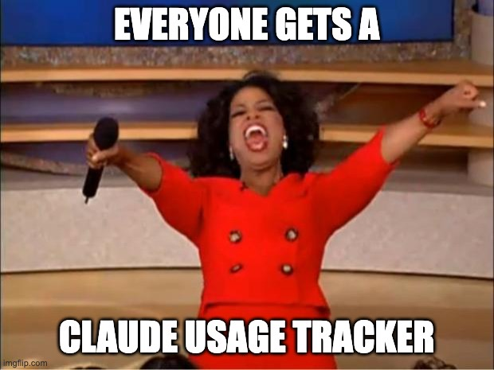

# Claude Usage Tracker Tracker



Everyone's building Claude usage trackers. This repo tracks them.


## The App

A macOS menu bar app that shows the live count.

```bash
cd app && swift build -c release
open ClaudeTrackerTracker.app
```

## Leaderboard

| # | Name | Stars | Description |
|---|------|-------|-------------|
| 1 | [Claude-Usage-Tracker](https://github.com/hamed-elfayome/Claude-Usage-Tracker) | 1,934 | Native macOS menu bar app for tracking Claude AI usage limits in real-time. Built with Swift/SwiftUI. |
| 2 | [opensync](https://github.com/waynesutton/opensync) | 349 | Cloud-synced dashboards for OpenCode and Claude Code. Track sessions, search with semantic lookup, export eval datasets. |
| 3 | [Claude-Usage-Extension](https://github.com/lugia19/Claude-Usage-Extension) | 247 | Claude Usage Tracker browser extension |
| 4 | [ClaudeUsageTracker](https://github.com/masorange/ClaudeUsageTracker) | 109 | Track your Claude Code API usage from your macOS menu bar with accurate cost calculations |
| 5 | [claude-usage-tracker](https://github.com/658jjh/claude-usage-tracker) | 36 | Track and visualize Claude AI usage costs across all local tools — OpenClaw, Claude Code, Claude Desktop, Cursor, Windsurf, Cline, Roo Code, Aider, and Continue.dev |

[View all 24 →](trackers.json)

## How It Works

- GitHub Action runs daily at 9 AM UTC
- Searches for new Claude usage trackers
- Updates star counts
- Opens PR for review (no auto-merge)
- Excluded repos stay excluded ([excluded.json](excluded.json))

## Add a Tracker

[Open an issue](../../issues/new) or PR to `trackers.json`.
