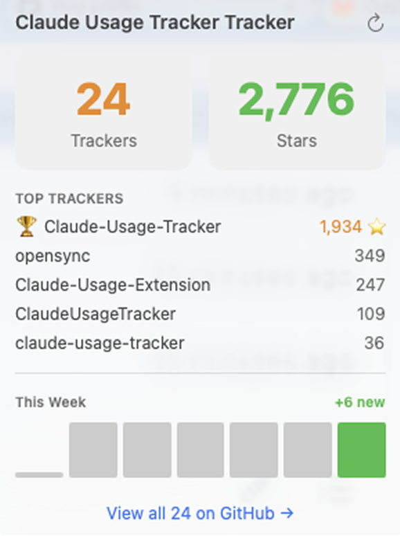

# Claude Usage Tracker Tracker

<p align="center">
  
  <br><br>
  <strong>Everyone's building Claude usage trackers. This repo tracks them.</strong>
  <br><br>
  
  
</p>

<p align="center">
  
</p>

## The App

A macOS menu bar app that shows the live tracker count, leaderboard, and weekly activity.

```bash
cd app && swift build -c release
open ClaudeTrackerTracker.app
```

## Leaderboard

| # | Name | Stars | Description |
|---|------|-------|-------------|
| **1** | **[Claude-Usage-Tracker](https://github.com/hamed-elfayome/Claude-Usage-Tracker)** | **1,934** | Native macOS menu bar app for tracking Claude AI usage limits in real-time. Built with Swift/SwiftUI. |
| **2** | **[opensync](https://github.com/waynesutton/opensync)** | **349** | Cloud-synced dashboards for OpenCode and Claude Code. Track sessions, search with semantic lookup, export eval datasets. |
| **3** | **[Claude-Usage-Extension](https://github.com/lugia19/Claude-Usage-Extension)** | **247** | Claude Usage Tracker browser extension |
| **4** | **[ClaudeUsageTracker](https://github.com/masorange/ClaudeUsageTracker)** | **109** | Track your Claude Code API usage from your macOS menu bar with accurate cost calculations |
| **5** | **[claude-usage-tracker](https://github.com/658jjh/claude-usage-tracker)** | **36** | Track and visualize Claude AI usage costs across all local tools — OpenClaw, Claude Code, Claude Desktop, Cursor, Windsurf, Cline, Roo Code, Aider, and Continue.dev |
| 6 | [claude-usage-tracker-for-mac](https://github.com/penicillin0/claude-usage-tracker-for-mac) | 24 | Happy Hacking With Claude!!! |
| 7 | [claude-code-tracker](https://github.com/m-shirt/claude-code-tracker) | 20 | Self-hosted multi-user analytics dashboard for Claude Code — track sessions, conversations, token usage, and activity across your team. |
| 8 | [Oh-My-Claude](https://github.com/hey-pals/Oh-My-Claude) | 5 | Real-time monitoring dashboard for Claude Code — track tokens, agents, teams, costs, and activity live. |
| 9 | [claude-code-tracker](https://github.com/55onurisik/claude-code-tracker) | 5 | |
| 10 | [ClaudeUsageTracker](https://github.com/SergioBanuls/ClaudeUsageTracker) | 5 | Track your Claude Code API usage from your macOS menu bar with accurate cost calculations |
| 11 | [ClaudeUsageTracker](https://github.com/pratikbaid3/ClaudeUsageTracker) | 5 | |
| 12 | [claude-token-tracker](https://github.com/pepperonas/claude-token-tracker) | 4 | Token usage dashboard for Claude Code — tracks costs, sessions, models, and tools with real-time updates |
| 13 | [claude-peek](https://github.com/teambrilliant/claude-peek) | 4 | macOS notch status surface for Claude Code — track sessions, approve permissions, read conversations, reply. Privacy-first, native Swift/SwiftUI. |
| 14 | [sygil](https://github.com/Mastersam07/sygil) | 4 | Your System has awakened. A real-time analytics dashboard for Claude Code — track tokens, costs, sessions, file changes, and more. Zero config, zero cloud. |
| 15 | [ClaudeUsage](https://github.com/LouisVanh/ClaudeUsage) | 3 | Lightweight Claude Usage Tracker |
| 16 | [claude-usage-tracker](https://github.com/cfranci/claude-usage-tracker) | 3 | macOS menu bar app showing Claude usage limits and reset times |
| 17 | [claude-usage-tracker](https://github.com/haasonsaas/claude-usage-tracker) | 3 | Track and analyze Claude Code usage with rate limit awareness. Parse JSONL logs, calculate costs, and get warnings before hitting rate limits. |
| 18 | [claude-code-tracker](https://github.com/kelsi-andrewss/claude-code-tracker) | 3 | |
| 19 | [claude-code-usage-analytics](https://github.com/wangtae/claude-code-usage-analytics) | 3 | Multi-device usage monitoring and analytics dashboard for Claude Code |
| 20 | [claude-tracker](https://github.com/DSado88/claude-tracker) | 2 | Multi-account Claude usage tracker TUI (Rust/ratatui) |
| 21 | [cctrack](https://github.com/haoagent/cctrack) | 2 | Real-time cost & activity dashboard for Claude Code. Track every dollar, every token, every tool call. |
| 22 | [mcp-cost-tracker](https://github.com/IgniteStudiosLtd/mcp-cost-tracker) | 2 | MCP Cost Tracker for Claude Code - Track session costs across all projects with CSV storage and interactive dashboard |
| 23 | [claude-code-telemetry-setup](https://github.com/OmriYaHoo/claude-code-telemetry-setup) | 2 | One-command monitoring solution for Claude Code with a pre-configured Grafana dashboard. |
| 24 | [claude-usage-tracker](https://github.com/eli-manning/claude-usage-tracker) | 2 | |

## How It Works

- GitHub Action runs daily at 9 AM UTC
- Searches for new Claude usage trackers
- Updates star counts
- Opens PR for review (no auto-merge)
- Excluded repos stay excluded ([excluded.json](excluded.json))

## Add a Tracker

[Open an issue](../../issues/new) or PR to `trackers.json`.
